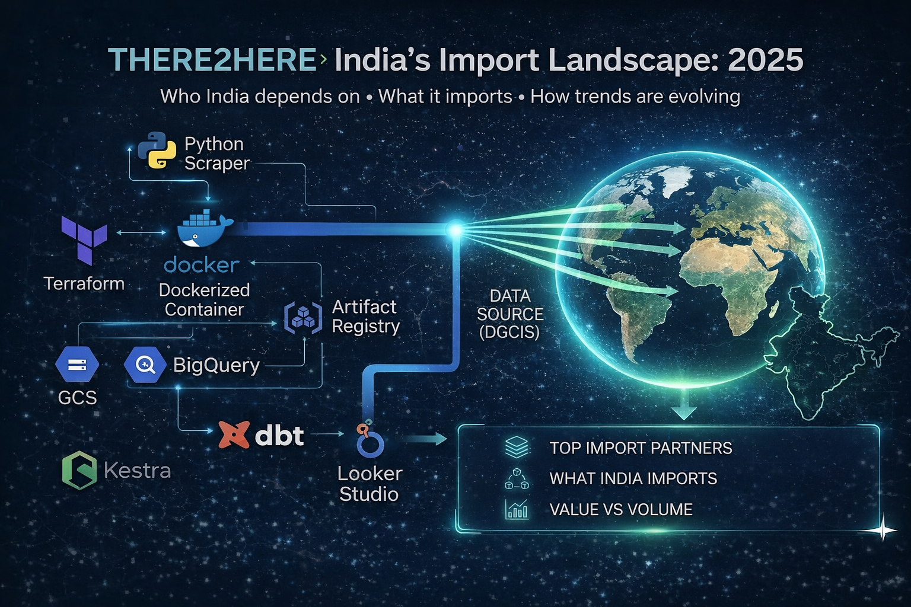
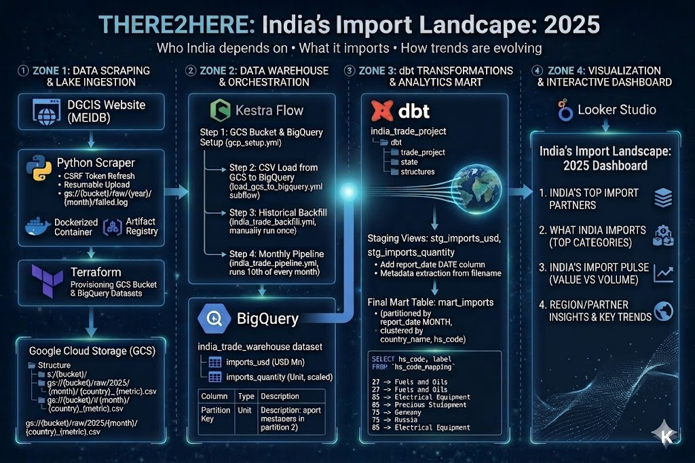
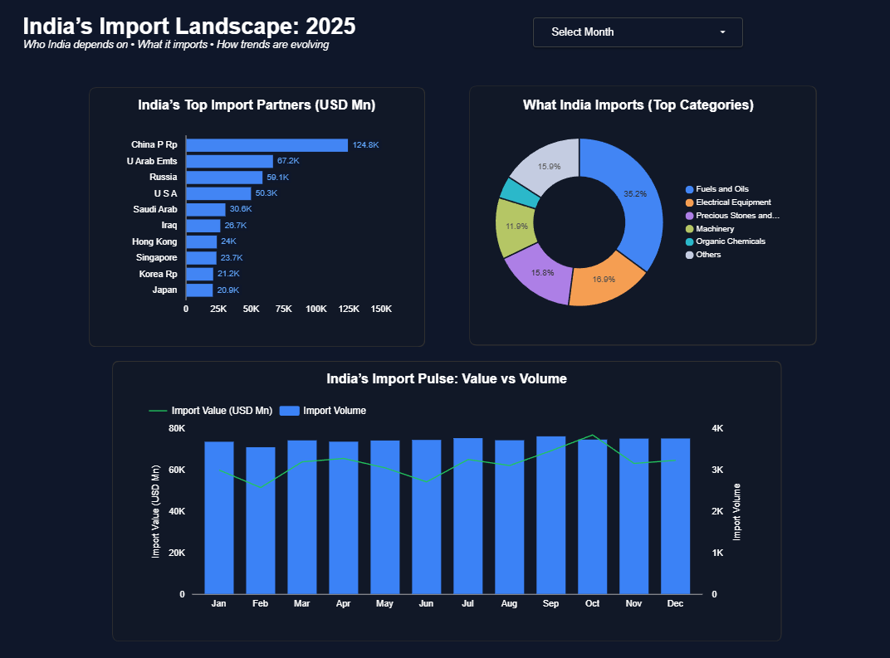

# THERE2HERE: India's Import Landscape 2025 

> *Who India depends on • What it imports • How trends are evolving*



---

## Problem Statement

As India moves toward becoming a $5 trillion economy, understanding its import dependencies becomes critical. This project answers three key questions:

- **Who** is India sourcing its imports from?
- **What** commodities are being imported?
- **How** are these dependencies shifting over time?

This end-to-end data engineering pipeline ingests, stores, transforms, and visualizes India's monthly trade data published by the Directorate General of Commercial Intelligence & Statistics (DGCIS), producing an interactive dashboard that makes these trends explorable.


---

## Architecture



The pipeline is divided into four zones:

| Zone | Description |
|---|---|
| **Zone 1** | Data scraping from DGCIS and ingestion into GCS (Data Lake) |
| **Zone 2** | Data Warehouse setup and Kestra orchestration |
| **Zone 3** | dbt transformations into analytics-ready mart |
| **Zone 4** | Looker Studio interactive dashboard |

### Data Flow

```
DGCIS Website (tradestat.commerce.gov.in/meidb)
        ↓
  Python Scraper (Dockerized)
  — CSRF token refresh per request
  — Resume capability (skips already-uploaded files)
  — Failed scrapes logged to GCS
        ↓
  Google Cloud Storage (Raw Data Lake)
  gs://{bucket}/raw/{year}/{month}/{country}_{metric}.csv
        ↓
  BigQuery (Data Warehouse)
  india_trade_warehouse.imports_usd
  india_trade_warehouse.imports_quantity
  [Partitioned by report_date MONTH, Clustered by country_name + hs_code]
        ↓
  dbt (Transformations)
  mart_imports — joined, enriched, ranked, categorized
        ↓
  Looker Studio Dashboard
```

All orchestrated end-to-end by **Kestra**.

---

## Tech Stack

| Layer | Technology |
|---|---|
| Cloud Provider | Google Cloud Platform (GCP) |
| Infrastructure (IaC) | Terraform |
| Data Lake | Google Cloud Storage (GCS) |
| Data Warehouse | BigQuery |
| Orchestration | Kestra (self-hosted via Docker) |
| Scraper | Python + Docker |
| Container Registry | Google Artifact Registry |
| Transformations | dbt (dbt-bigquery 1.11) |
| Dashboard | Looker Studio |

---

## Project Structure

```
there2here/
├── images/                           # Images for README
│   ├── banner.png
│   ├── dashboard.png
│   └── workflow.jpg
├── terraform/                        # IaC — GCS + BigQuery
│   ├── main.tf
│   ├── variables.tf
│   ├── outputs.tf
│   ├── provider.tf
│   └── terraform.tfvars
├── scraper/                          # Python scraper
│   ├── src/
│   │   └── scraper.py
│   ├── Dockerfile
│   └── requirements.txt
├── kestra/                           # Orchestration
│   ├── docker-compose.yml
│   └── flows/
│       ├── gcp_kv.yml
│       ├── gcp_setup.yml
│       ├── india_trade_backfill.yml
│       ├── load_gcs_to_bigquery.yml
│       └── india_trade_pipeline.yml
└── india_trade/                      # dbt project
    ├── models/
    │   ├── staging/
    │   │   ├── sources.yml
    │   │   ├── stg_imports_usd.sql
    │   │   └── stg_imports_quantity.sql
    │   └── marts/
    │       ├── schema.yml
    │       └── mart_imports.sql
    └── dbt_project.yml
```


## Dataset

| Property | Value |
|---|---|
| Source | DGCIS — tradestat.commerce.gov.in/meidb |
| Coverage | January 2025 – December 2025 |
| Metrics | Import Value (USD Millions) + Import Quantity |
| Granularity | Country × HS Code (2-digit) × Month |
| Countries | ~250 trading partners |
| Commodities | 99 HS Code chapters |

> **Note:** DGCIS publishes data with a ~3 month lag. The monthly pipeline accounts for this automatically by always scraping 3 months prior to the execution date.

---

## Prerequisites

Ensure the following are installed before starting:

- [Google Cloud account](https://cloud.google.com) with billing enabled
- [Docker Desktop](https://www.docker.com/products/docker-desktop/)
- [Terraform](https://developer.hashicorp.com/terraform/install) (>= 1.0)
- [Python 3.11](https://www.python.org/downloads/release/python-3119/)
- [gcloud CLI](https://cloud.google.com/sdk/docs/install)
- dbt-bigquery: `pip install dbt-bigquery`

---

## Reproduction Guide

### Step 1 — Clone the Repository

```bash
git clone https://github.com/kaur-harman/there2here.git
cd there2here
```

---

### Step 2 — GCP Setup

#### 2.1 Create a GCP Project
Go to [console.cloud.google.com](https://console.cloud.google.com), create a new project and note your **Project ID**.

#### 2.2 Enable APIs
Enable the following in your project:
- BigQuery API
- Cloud Storage API
- Artifact Registry API

#### 2.3 Create a Service Account
Go to **IAM & Admin → Service Accounts → Create Service Account** and assign these roles:
- BigQuery Admin
- Storage Admin
- Storage Object Admin
- Storage Object Viewer

#### 2.4 Download the Key
Click the service account → **Keys → Add Key → Create New Key → JSON**

Save it as:
```
scraper/credentials/service-account.json
```

#### 2.5 Create an Artifact Registry Repository
Go to **Artifact Registry → Create Repository**:
- Name: `trade-scraper-repo`
- Format: `Docker`
- Region: your chosen region (e.g. `asia-south2`)

---

### Step 3 — Provision Infrastructure with Terraform

Update `terraform/terraform.tfvars` with your values:

```hcl
project_id = "your-gcp-project-id"
region     = "your-region"
```

Then run:

```bash
cd terraform

# Set credentials
export GOOGLE_APPLICATION_CREDENTIALS="$(pwd)/../scraper/credentials/service-account.json"
# Windows PowerShell:
# $env:GOOGLE_APPLICATION_CREDENTIALS="D:\path\to\there2here\scraper\credentials\service-account.json"

terraform init
terraform apply
```

This creates:
- **GCS bucket:** `{project_id}-trade-raw`
- **BigQuery dataset:** `india_trade_warehouse`

---

### Step 4 — Build and Push the Docker Scraper Image

```bash
cd scraper

# Authenticate Docker with Artifact Registry
gcloud auth configure-docker {region}-docker.pkg.dev

# Build
docker build -t trade-scraper:latest .

# Tag and push
docker tag trade-scraper:latest \
  {region}-docker.pkg.dev/{project_id}/trade-scraper-repo/trade-scraper:latest

docker push \
  {region}-docker.pkg.dev/{project_id}/trade-scraper-repo/trade-scraper:latest
```

Replace `{region}` and `{project_id}` with your actual values throughout.

---

### Step 5 — Set Up Kestra

#### 5.1 Start Kestra

```bash
cd kestra
docker-compose up -d
```

Open **http://localhost:8081** and log in:
- Email: `admin@kestra.io`
- Password: `Admin1234!`

#### 5.2 Add GCP Credentials to KV Store

Go to **Namespaces → there2here → KV Store → + New Key**:

| Key | Value |
|---|---|
| `GCP_SERVICE_ACCOUNT` | Paste the full contents of `service-account.json` |

#### 5.3 Create the Flows

Go to **Flows → + Create** and paste each YAML in this order from `kestra/flows/`:

| Order | File | Description | Run |
|---|---|---|---|
| 1 | `gcp_kv.yml` | Sets project ID, bucket, dataset, region in KV store | Execute manually |
| 2 | `gcp_setup.yml` | Creates GCS bucket + BigQuery dataset | Execute manually |
| 3 | `load_gcs_to_bigquery.yml` | Subflow: loads CSVs from GCS into BigQuery | Called automatically |
| 4 | `india_trade_backfill.yml` | One-time historical scrape for a full year | Execute manually |
| 5 | `india_trade_pipeline.yml` | Monthly scheduled pipeline (runs 10th of each month) | Triggered by schedule |

> Update the `defaults` in each flow's inputs to match your `project_id`, `bucket_name`, and Docker image URL.

#### 5.4 Run Initial Setup

Execute these flows manually in order:
1. **gcp_kv** — populates KV store
2. **gcp_setup** — creates GCP resources

---

### Step 6 — Run Historical Backfill

Execute `india_trade_backfill` with:

| Input | Value |
|---|---|
| `year` | `2025` |
| `months` | `["01","02","03","04","05","06","07","08","09","10","11","12"]` |
| `table_suffix` | *(leave empty for production tables)* |

This flow will:
1. Scrape all 12 months from DGCIS (~3–4 hours total, resume-safe)
2. Upload CSVs to GCS at `gs://{bucket}/raw/2025/{month}/{country}_{metric}.csv`
3. Automatically call `load_gcs_to_bigquery` subflow to load into BigQuery

After completion, BigQuery will have:
- `india_trade_warehouse.imports_usd` — ~110K rows, 12 partitions
- `india_trade_warehouse.imports_quantity` — ~107K rows, 12 partitions

Both tables are:
- **Partitioned** by `report_date` (MONTH granularity)
- **Clustered** by `country_name`, `hs_code`

> **Resume:** If the scraper fails partway, re-running skips already-uploaded GCS files automatically.
> **Failures** are logged to `gs://{bucket}/logs/{year}/{month}/failed.log`

---

### Step 7 — Run dbt Transformations

#### 7.1 Set Up dbt

```bash
cd india_trade

# Python 3.11 required — use pyenv if needed
python -m venv dbt-env
source dbt-env/bin/activate      # Mac/Linux
# dbt-env\Scripts\activate       # Windows

pip install dbt-bigquery
```

#### 7.2 Configure Profile

Create `~/.dbt/profiles.yml`:

```yaml
india_trade:
  outputs:
    dev:
      type: bigquery
      method: service-account
      project: your-gcp-project-id
      dataset: india_trade_warehouse
      threads: 4
      keyfile: /path/to/there2here/scraper/credentials/service-account.json
      location: your-region
      job_execution_timeout_seconds: 300
      job_retries: 1
  target: dev
```

#### 7.3 Run dbt

```bash
dbt debug    # verify connection — should show "All checks passed"
dbt run      # build all models
dbt test     # run data quality tests — should show 3/3 PASS
```

This creates in BigQuery:

| Model | Type | Description |
|---|---|---|
| `stg_imports_usd` | View | Cleaned USD staging layer, filters total/summary rows |
| `stg_imports_quantity` | View | Cleaned quantity staging layer, filters total/summary rows |
| `mart_imports` | Table | Final analytics mart — joined, enriched, partitioned, clustered |

#### `mart_imports` — key derived columns

| Column | Description |
|---|---|
| `report_date` | DATE — first day of month, partition key |
| `total_monthly_imports_usd` | Total India imports that month |
| `import_share_pct` | This row as % of monthly total |
| `country_rank_by_commodity` | Rank of country as supplier per commodity per month |
| `commodity_rank` | Rank of commodity by total value per month |
| `price_proxy_usd_per_unit` | USD millions × 1M ÷ quantity (exploratory) |
| `growth_category` | high_growth (≥25%) / moderate_growth (≥5%) / stable (>-5%) / decline |
| `ytd_growth_category` | Same thresholds applied to YTD growth % |
| `commodity_clean` | Clean commodity label from `hs_code_mapping` |

---

### Step 8 — Connect Looker Studio Dashboard

1. Go to [lookerstudio.google.com](https://lookerstudio.google.com)
2. Click **+ Create → Report**
3. Add data source: **BigQuery → your project → india_trade_warehouse → mart_imports**
4. Click **Add to Report**

#### Build the 3 tiles:

**Tile 1 — India's Top Import Partners**
- Chart: Horizontal Bar
- Dimension: `country_name`
- Metric: `SUM(month_curr_year_usd)` — label "Total Imports (USD Mn)"
- Breakdown dimension: `growth_category`
- Sort: Descending, Row limit: 15
- Cross-filtering: Off

**Tile 2 — What India Imports**
- Chart: Donut / Pie
- Dimension: `commodity_clean`
- Metric: `SUM(month_curr_year_usd)`
- Filter: `commodity_rank ≤ 10`
- Cross-filtering: Off

**Tile 3 — India's Import Pulse**
- Chart: Combo chart
- X axis: `report_date`
- Bar (left axis): `SUM(month_curr_year_usd)` — label "Import Value (USD Mn)"
- Line (right axis): `SUM(qty_scaled)` — label "Import Volume"
- Default date range: **Auto: all available dates** (so month filter doesn't affect this tile)
- Cross-filtering: Off


**Add a month filter:**
- Insert → Drop-down list → Control field: `report_date` → Label: "Select Month"

---

## Pipeline Flow Summary

```
Flow 1: india_trade_backfill         ← run onceto backfill data
  ├── Scrapes all months for given year from DGCIS
  ├── Uploads CSVs to GCS
  └── Calls load_gcs_to_bigquery subflow automatically

Flow 2: load_gcs_to_bigquery         ← subflow (called automatically)
  ├── Reads CSVs from GCS for given year/months
  ├── Extracts metadata from filenames (country, metric)
  ├── Creates report_date = DATE(year, month, 1)
  └── Loads into BigQuery: imports_usd + imports_quantity

Flow 3: india_trade_pipeline         ← runs automatically on 10th of every month
  ├── Target month = execution month − 3 (DGCIS publication lag)
  ├── Scrapes that month's data
  └── Calls load_gcs_to_bigquery subflow
```
---

## Live Dashboard

🔗 [View India Import Analytics Dashboard 2025](https://datastudio.google.com/reporting/0466a4bc-8244-4bf9-b574-7762a6b2b436)



## Key Insights

- **China dominates India’s imports**, significantly ahead of all other partners  
- **Energy imports (fuels and oils)** form the largest share of total imports  
- **Electronics and machinery** consistently rank among top categories  
- **Import volumes remain stable**, while value fluctuates, indicating price-driven changes  
- **Limited diversification in top partners**, suggesting dependency concentration  
---
